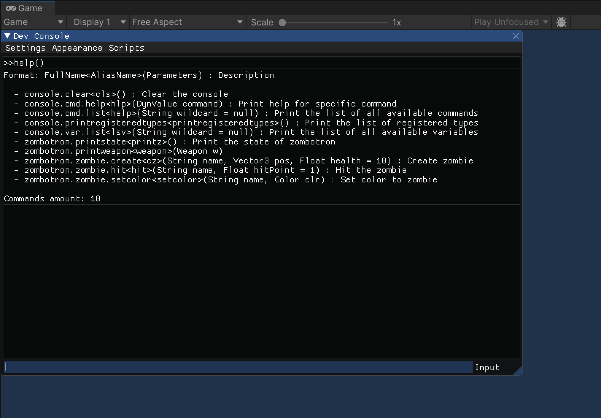
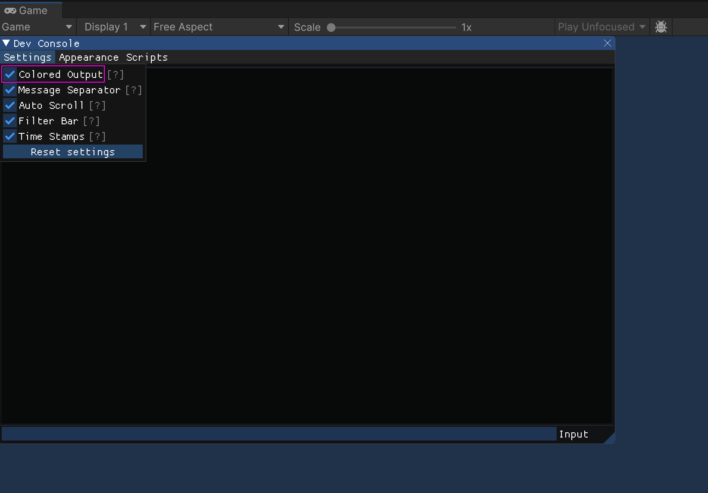
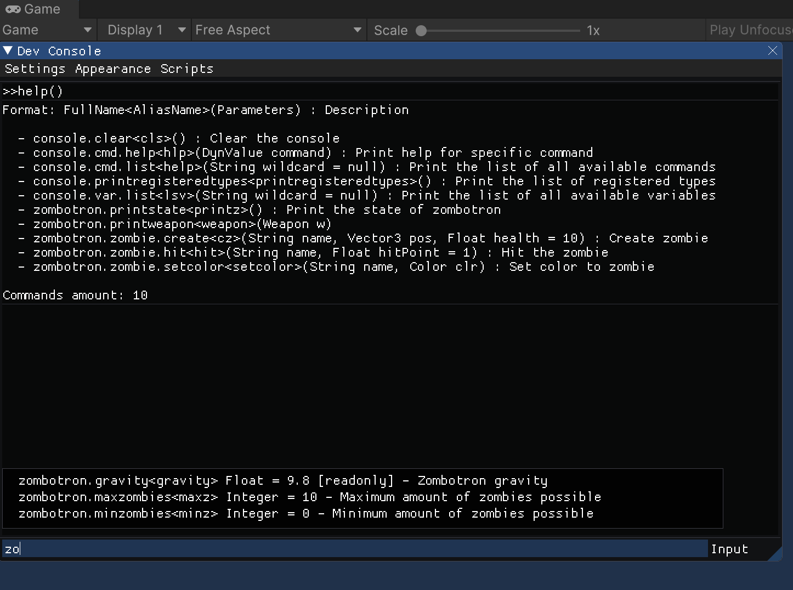
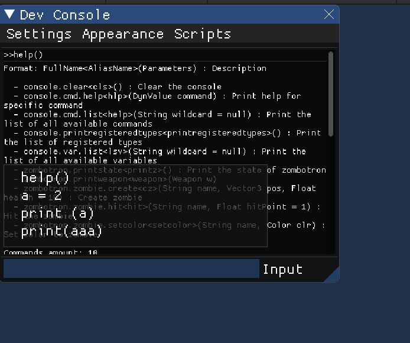

# Qonsole
## What is Qonsole?
Quake-like ingame console with integrated lua for Unity
The formula of qonsole is:

```
qonsole = uimgui + moonsharp + ingameconsole
```

UImGUI is a port of ImGUI to Unity.
Moonsharp is a Lua interpeter implemented in c#.
IngameConsole is a Unity console which supports commands execution. Qonsole take inspiration from this lib.







## What are killer features of Qonsole?
* Fast rendering and more responsive input using uimgui
* Lua scripting. You can register commands to the console. After that you can use them for direct call from the console or from the script file, you can use them in cycles and so on
* Variables registration
* Alias names for function and variables
* Advanced log filtering using LogManager

# IMPORTANT NOTES
The project has been postponed for the following reasons:
* UImGUI has not been ported to mobile platforms.
* The Windows port has lack of features and it's not fully ported to Unity.
* Check out uconsole which is based on Unity GUI instead of uimgui https://github.com/cholushkin/qonsole 
